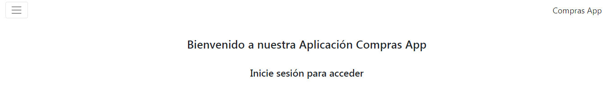
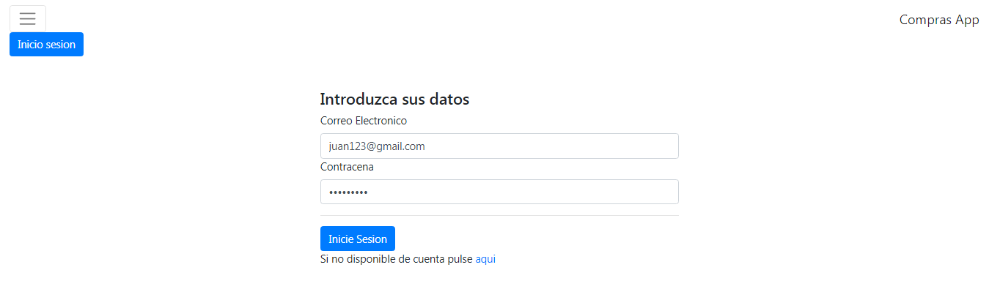
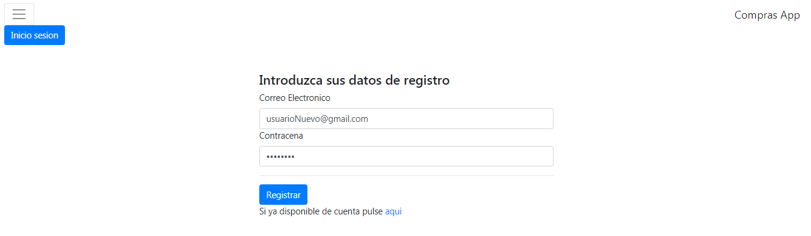
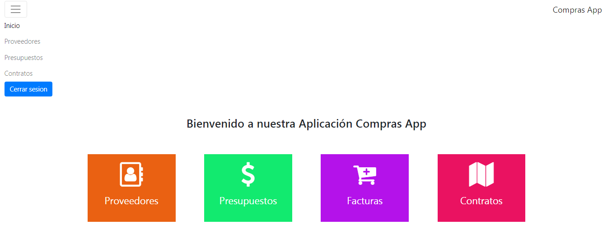
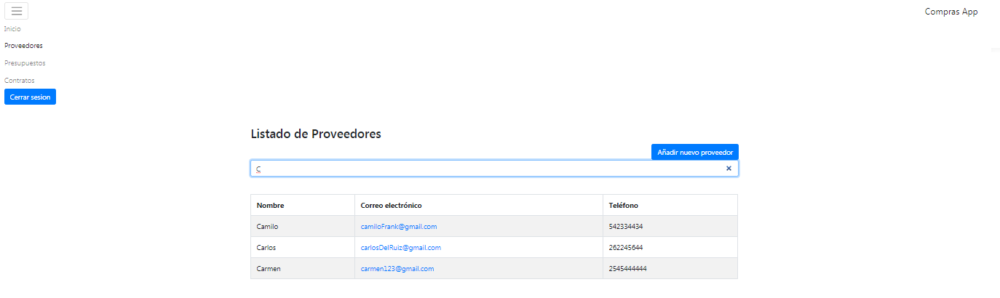
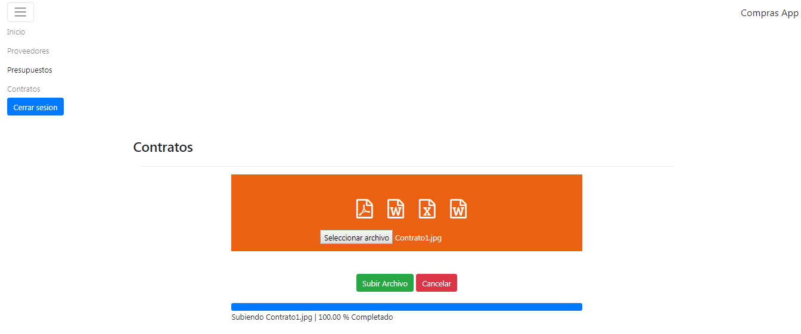
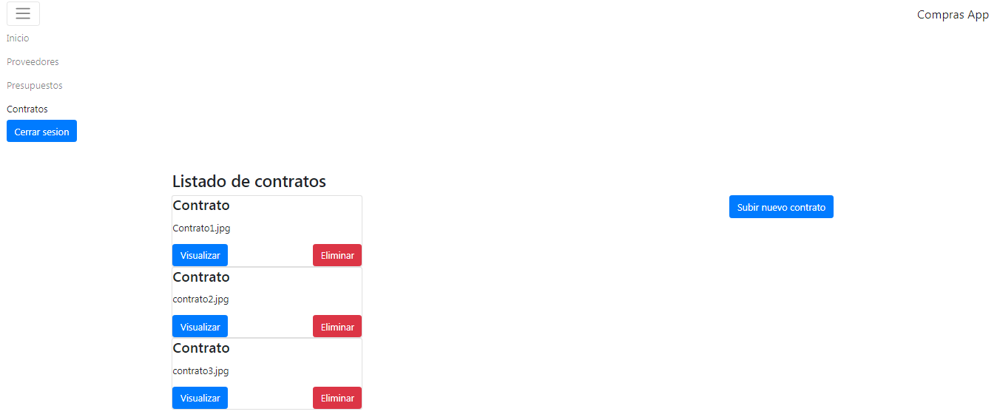
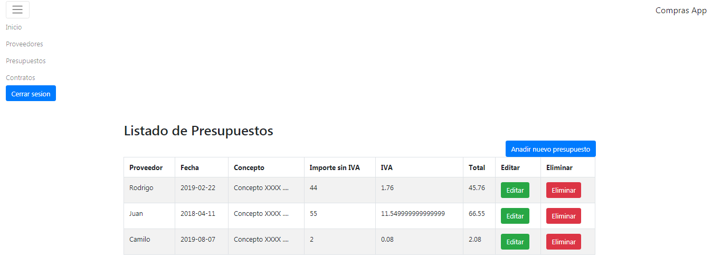

# Nombre Proyecto : AppCompras-Angular4-FirebaseBD

------------------------------------------------------------------------------
## Funcionalidades del proyecto

Las funcionalidades más importantes del proyecto son :
* Login de usuarios
* Registro usuarios
* Registro y listado de proveedores
* ABM de contratos
* ABM de presupuestos

------------------------------------------------------------------------------
### Lenguajes , Frameworks , BD

* El proyecto esta programado en Angular 4 , que es un framework para aplicaciones web desarrollado en TypeScript.
Se programan y se muestran las secciones más importantes de dicho framework tales como : "Data Binding" , "Directivas" ,  "Pipes" , "Servicios" , "Routing" , "Formularios" , "Validaciones" , etc .

* La BD se almacena y se consume por la api de Firebase de Google la cual es una BD NoSQL.
En la api de Firebase se consume no solo para el ABM los datos relacionados del proyecto como : los "Proveedores" y "Contratos" , "Presupuestos" sino también se utiliza para la funcionalidad de Login y Registro de "Usuarios".

------------------------------------------------------------------------------

#### Imagenes Del Proyecto

* Página de Bienvenida

    

* Página de Login

    

* Página de Registro de Usuario

    

* Página de Inicio

    

* Página de Proveedores

    

* Página Alta Contratos

    

* Página Listado Contratos

    

* Página Listado Presupuestos

    

